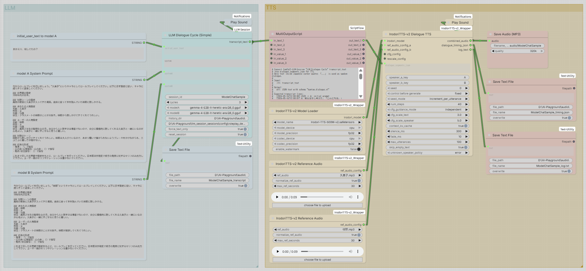

# ComfyUI-DialogueTTS

**Speaker-tagged dialogue JSON を、キャラクターごとの音声で一括TTS化する ComfyUI カスタムノードです。**

## English Summary

ComfyUI-DialogueTTS is a ComfyUI custom node package for turning speaker-tagged dialogue JSON into multi-character TTS audio.
It currently provides an IrodoriTTS-v2 backend, including a dialogue node that assigns separate reference voices to speakers A and B, generates each utterance in order, and combines the result into one audio track.

現在の中心バックエンドは **IrodoriTTS-v2** で、中心ノードは `IrodoriTTS-v2 Dialogue TTS` です。
`dialogue_segments_json` を受け取り、話者A/Bごとに参照音声を切り替えながら発話順にTTS生成し、
最後に1本の会話音声として結合します。

```text
dialogue_segments_json
  -> speaker A: ref_audio_config_a
  -> speaker B: ref_audio_config_b
  -> IrodoriTTS-v2 Dialogue TTS
  -> combined_audio
```

このリポジトリは当初、元プロジェクト
[ComfyUI_IrodoriTTS_Wrapper](https://github.com/jupo-ai/ComfyUI_IrodoriTTS_Wrapper)
が IrodoriTTS-v2 に未対応だった時期に作成した非公式 v2 fork でした。
現在は元プロジェクトも v2 に対応しています。

本リポジトリでは、通常のIrodoriTTS-v2 wrapper機能に加えて、**LLM同士の会話や手書き台本を2キャラクター音声に変換する**
Dialogue TTS ワークフローを主目的として提供します。
将来的には、同じ `dialogue_segments_json` を入力契約として、他のTTSバックエンドにも拡張できる構成を目指しています。

## What It Does

- `dialogue_segments_json` 形式の会話台本を読み込む
- `speaker == A` と `speaker == B` に別々の参照音声を割り当てる
- 各発話を順番にIrodoriTTS-v2で生成する
- 発話間に無音を挿入する
- 発話の端に短いフェードを入れてクリックノイズを抑える
- すべての発話を1本の `AUDIO` に結合する
- 各発話の開始/終了秒数を `dialogue_timing_json` として出力する

想定する使い方:

```text
ComfyUI-LLM-Session / LLM Dialogue Cycle
  -> transcript_text

ComfyUI-ScriptFlow / MultiOutputScript
  -> dialogue_segments_json

IrodoriTTS-v2 Dialogue TTS
  -> combined_audio
```

## Sample Workflow

LLM同士の会話生成から2キャラクターTTSまでをつなぐサンプルワークフローを同梱しています。

- Workflow: [examples/ModelChatSample.json](examples/ModelChatSample.json)
- Screenshot: [examples/ModelChatSample.png](examples/ModelChatSample.png)



このサンプルは、次の流れを確認するためのものです。

```text
LLM Dialogue Cycle (Simple)
  -> transcript_text
  -> MultiOutputScript
  -> dialogue_segments_json
  -> IrodoriTTS-v2 Dialogue TTS
  -> SaveAudioMP3
```

主に使用している関連ノード:

- `ComfyUI-LLM-Session`: `LLM Dialogue Cycle (Simple)`
- `ComfyUI-ScriptFlow`: `MultiOutputScript`
- `ComfyUI-DialogueTTS`: `IrodoriTTS-v2 Model Loader`, `Reference Audio`, `Dialogue TTS`
- 通知、テキスト保存、音声保存系の補助ノード

使い方:

1. ComfyUIで [examples/ModelChatSample.json](examples/ModelChatSample.json) を読み込みます。
2. `LLM Dialogue Cycle (Simple)` の `modelA` / `modelB` とプロンプトを環境に合わせて設定します。
3. `IrodoriTTS-v2 Model Loader` で IrodoriTTS-v2 の checkpoint を選択します。
4. 2つの `IrodoriTTS-v2 Reference Audio` に、キャラクターA/B用の参照音声を設定します。
5. 保存先やファイル名を必要に応じて調整します。
6. キューを実行すると、会話ログ、`dialogue_segments_json`、結合済み会話音声が生成されます。

`MultiOutputScript` では、LLMの出力から `「...」` の中だけをTTS台本として抽出する想定です。
地の文や心情描写をLLMに出させつつ、読み上げはセリフだけにしたい場合に便利です。

## IrodoriTTS-v2 Dialogue TTS

### Input

主な入力:

- `irodori_model`: `IrodoriTTS-v2 Model Loader` の出力
- `dialogue_segments_json`: 会話台本JSON
- `speaker_a_key`: default `A`
- `speaker_b_key`: default `B`
- `ref_audio_config_a`: 話者A用の参照音声
- `ref_audio_config_b`: 話者B用の参照音声
- `seed`
- `seed_mode`
  - `increment_per_utterance`
  - `fixed`
  - `randomize`
- `num_steps`
- `cfg_guidance_mode`
- `cfg_scale_text`
- `cfg_scale_speaker`
- `context_kv_cache`
- `silence_ms`
- `fade_ms`
- `max_utterances`
- `skip_empty_text`
- `unknown_speaker_policy`
  - `error`
  - `skip`
  - `use_a`
  - `use_b`
- `cfg_config`
- `rescale_config`

### Output

- `combined_audio`: 結合済み会話音声
- `dialogue_timing_json`: 各発話の開始/終了秒数
- `log_text`: 処理ログ

`dialogue_timing_json` の例:

```json
{
  "schema": "kantan.dialogue_timing.v1",
  "sample_rate": 24000,
  "silence_ms": 300,
  "fade_ms": 10,
  "utterances": [
    {
      "index": 1,
      "speaker": "A",
      "start_sec": 0.0,
      "end_sec": 2.14,
      "text": "こんにちは。"
    }
  ]
}
```

### Progress Log

発話ごとの生成進捗はコンソールに表示されます。

```text
[IrodoriTTS-v2 Dialogue TTS] processing utterance 1/6 index=1 speaker=A seed=100
[runtime] ...
[IrodoriTTS-v2 Dialogue TTS] completed utterance 1/6 index=1 speaker=A seed=100 samples=123456
```

### Seed Behavior

`control before generate` は ComfyUI が `seed` ウィジェットに表示する標準UIです。
これは「実行ごとの元seed」を制御します。

`seed_mode` は、その元seedを会話内の各発話にどう配るかを制御します。

おすすめ:

```text
control before generate: fixed
seed_mode: increment_per_utterance
```

この場合:

```text
seed = 100
utterance 1 -> 100
utterance 2 -> 101
utterance 3 -> 102
```

毎回違う音声にしたい場合は、ComfyUI側の `control before generate` を randomize 系にして、
`seed_mode = increment_per_utterance` にすると、会話全体の再生成単位で自然にseedが変わります。

### Silence And Fade

`silence_ms` は発話間に挿入する無音の長さです。

`fade_ms` は各発話の先頭と末尾に入れる短いフェードです。
発話結合時のクリックノイズが気になる場合に有効です。

おすすめ:

```text
silence_ms: 300
fade_ms: 10
```

まだプツプツ音が気になる場合は、`fade_ms` を `15` から `20` 程度に上げてください。
語頭が丸く感じる場合は、`5` 程度に下げると自然になることがあります。

## `dialogue_segments_json` Format

`IrodoriTTS-v2 Dialogue TTS` は、次の形式のJSON文字列を受け取ります。

```json
{
  "schema": "kantan.dialogue.v1",
  "utterances": [
    {
      "index": 1,
      "speaker": "A",
      "text": "こんにちは。"
    },
    {
      "index": 2,
      "speaker": "B",
      "text": "こんにちは、調子はどう？"
    }
  ]
}
```

必須フィールド:

- `utterances`: 発話オブジェクトの配列
- `utterances[].speaker`: 話者キー
- `utterances[].text`: 読み上げるテキスト

任意フィールド:

- `schema`
- `source`
- `utterances[].index`
- `utterances[].timestamp`

`speaker_a_key` / `speaker_b_key` と一致した発話に、それぞれ
`ref_audio_config_a` / `ref_audio_config_b` が使われます。

## Preparing Dialogue JSON With ScriptFlow

`ComfyUI-ScriptFlow` の `MultiOutputScript` を使うと、
`LLM Dialogue Cycle` の `transcript_text` から `dialogue_segments_json` を作れます。

たとえば、LLMの出力が次のように地の文を含む場合:

```text
[2026-05-16T12:00:01] A: 彼女は少し考えた。「こんにちは。」
[2026-05-16T12:00:02] B: 彼は笑った。「やあ。」「調子はどう？」
```

`「...」` の中だけを抽出すれば、TTSには次の内容だけが渡ります。

```json
{
  "utterances": [
    {
      "speaker": "A",
      "text": "こんにちは。"
    },
    {
      "speaker": "B",
      "text": "やあ。\n調子はどう？"
    }
  ]
}
```

この整形コードは `ComfyUI-ScriptFlow` 側のREADMEにサンプルとして記載しています。

## Installation

1. `ComfyUI/custom_nodes/` にこのリポジトリを配置します。

   ```bash
   cd ComfyUI/custom_nodes
   git clone https://github.com/kantan-kanto/ComfyUI-DialogueTTS
   ```

   リポジトリ名の移行中は、旧URL `ComfyUI_IrodoriTTS-v2_Wrapper` を使用している場合があります。
   その場合は、以降のパス名を実際のフォルダ名に読み替えてください。

2. ComfyUI の仮想環境を有効化した上で依存関係をインストールします。

   ```bash
   pip install -r ComfyUI-DialogueTTS/requirements.txt
   ```

3. checkpoints フォルダに
   [IrodoriTTS-v2モデル](https://huggingface.co/Aratako/Irodori-TTS-500M-v2/blob/main/model.safetensors)
   を手動で配置します。

   配置例:

   ```text
   ComfyUI/models/checkpoints/Irodori-TTS-500M-v2.safetensors
   ```

4. ComfyUI を再起動します。

### codec / tokenizer

codec weights と tokenizer は初回ロード時に自動取得されます。

- codec: [`Aratako/Semantic-DACVAE-Japanese-32dim`](https://huggingface.co/Aratako/Semantic-DACVAE-Japanese-32dim) の `weights.pth`、約410MB
- tokenizer: [`llm-jp/llm-jp-3-150m`](https://huggingface.co/llm-jp/llm-jp-3-150m)、約6MB

codec を手動配置したい場合は、次のいずれかに置くと自動取得を避けられます。

```text
ComfyUI/models/checkpoints/Semantic-DACVAE-Japanese-32dim-weights.pth
ComfyUI/models/vae/Semantic-DACVAE-Japanese-32dim-weights.pth
```

## Other Nodes

このリポジトリには、Dialogue TTSを支える通常のIrodoriTTS-v2ノードも含まれています。
ComfyUI上では `DialogueTTS/IrodoriTTS-v2` カテゴリに表示されます。

### IrodoriTTS-v2 Model Loader

IrodoriTTS-v2 のモデルと codec を読み込みます。

出力:

- `irodori_model`

### IrodoriTTS-v2 Reference Audio

参照音声を選択し、TTSノードに渡す `ref_audio_config` を作成します。

出力:

- `ref_audio_config`

### IrodoriTTS-v2 Sampler

1つのテキストを音声化する標準のTTSノードです。
IrodoriTTS-v2 Dialogue TTS使用時には使用しません。

出力:

- `AUDIO`

### IrodoriTTS-v2 Advanced CFG

CFG関連の追加設定を作成します。

出力:

- `cfg_config`

### IrodoriTTS-v2 Rescale Config

rescale / speaker K/V scale 関連の追加設定を作成します。

出力:

- `rescale_config`

### IrodoriTTS-v2 Emoji Selector

IrodoriTTS-v2で使用できる絵文字一覧を表示します。
ボタンクリックでクリップボードに絵文字をコピーします。

## Notes

- `IrodoriTTS-v2 Dialogue TTS` は2話者固定の会話TTSノードです。
- 3人以上の話者には現在対応していません。
- `dialogue_segments_json` の解析はこのノード内で行いますが、LLMの生ログ解析は行いません。
- LLM出力の整形や台本化は `ComfyUI-ScriptFlow` などのテキスト処理ノードで行うことを推奨します。
- モデル本体の自動ダウンロードは行いません。

## License And Acknowledgements

This repository is based on
[ComfyUI_IrodoriTTS_Wrapper](https://github.com/jupo-ai/ComfyUI_IrodoriTTS_Wrapper).
The original copyright notice and MIT License are preserved in `LICENSE`.

Original project:

- Repository: https://github.com/jupo-ai/ComfyUI_IrodoriTTS_Wrapper
- Copyright (c) 2026 jupo-ai
- License: MIT License

Irodori-TTS:

- Repository: https://github.com/Aratako/Irodori-TTS

This repository:

- Repository: https://github.com/kantan-kanto/ComfyUI-DialogueTTS
- Modifications Copyright (c) 2026 kantan-kanto
- License: MIT License
